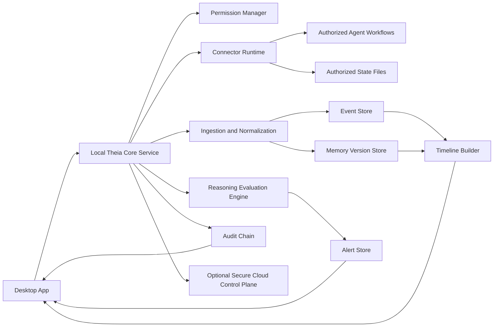

# 5. Core Platform Architecture

## End-to-End Architecture

## Components

- Desktop App (`apps/desktop`)
  - Multi-view control center for observability and governance

- Local Core (`apps/local-core`)
  - Ingestion, parsing, normalization, timeline reconstruction, alert evaluation

- Optional Control Plane (`apps/control-plane`)
  - SAML-ready authentication, login-volume tracking, and governance surface bootstrap

- Connector SDK (`packages/connector-sdk`)
  - Capability contracts for safe, permission-scoped connectors

- Event Schema (`packages/event-schema`)
  - Canonical model for agents, runs, tasks, memory, events, alerts, and audit

- Reasoning Engine (`packages/reasoning-engine`)
  - Assistive heuristic framework for likely reasoning quality issues

- Policy Engine (`packages/policy-engine`)
  - RBAC + grants + audit chain for access decisions

## Cross-Platform Recommendation

The architecture remains Tauri-ready for Rust-backed local runtime hardening. In this implementation, the desktop shell is React/Vite for rapid delivery and validation.
