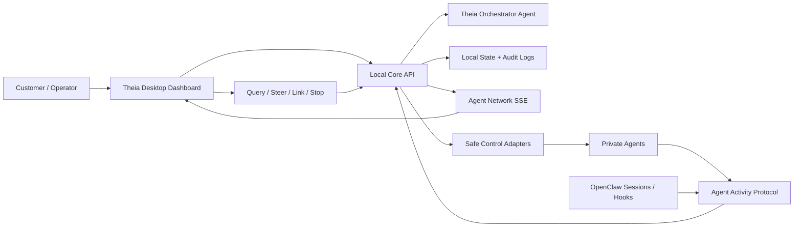

# Agent Command Center Architecture

## Project Audit

`feature_ship` is Theia: a local-first desktop dashboard, local-core API, optional control plane, connector SDK, workflow event schema, policy engine, and OpenClaw integration. Before this implementation, the product already had strong foundations for local ingestion, OpenClaw push telemetry, authenticated dashboard routes, audit records, and emergency stop. The missing layer was a user-facing agent network model: private agent registration, standardized agent reports, live topology, per-agent controls, and a distribution story that non-technical users could follow.

## Current Product Interpretation

The right product direction is an agent command center, not a generic log monitor. Theia should let a user install a local control center, introduce private agents, watch a visual network, and steer or stop activity through explicit, audited controls. The orchestrator should translate raw agent work into safe summaries, status, cost, tools, memory, and collaboration state.

## Problems Addressed

- Agent telemetry was split across existing workflow/OpenClaw events without one strict private-agent protocol.
- The desktop Agents view was a health table, not a control interface.
- Collaboration links, steering, query, and per-agent emergency stop were not first-class domain objects.
- OpenClaw telemetry existed, but the command center needed a stricter agent activity envelope.
- Distribution docs emphasized developer setup and installers, but not the hybrid one-line/clone strategy.

## Refined Product Idea

Theia ships a local orchestrator and dashboard that customers can install or clone. Private agents remain user-owned and may be local, API-based, OAuth-based, terminal-driven, or OpenClaw-based. Agents push standardized activity events into local-core. The orchestrator validates, redacts, classifies, stores, and broadcasts the events. The dashboard renders stats, cards, live bubbles, links, and controls.

## Recommended Architecture

Decisions:

- Product shape: hybrid standalone dashboard plus OpenClaw integration. Standalone is the main product; OpenClaw is a first-class adapter.
- Orchestrator: bundled local orchestrator profile, with behavior expressed in protocol config and templates.
- Telemetry: private agents push events; local-core can also discover and poll known sources where available.
- Control: dashboard issues typed commands only. It never runs arbitrary shell text.
- Storage: local-first JSON state today; SQLite is the natural next step once event volume grows.

## Agent Communication Protocol

The strict protocol lives in `packages/agent-protocol`.

Minimum report:

- `schemaVersion`: `agent-activity/v1`
- `eventId`, `timestamp`, `workspaceId`
- `agent`: identity, role, model/vendor, connection kind
- `classification`: category, status, risk, confidence
- `what`: objective/current task/safe summary/decision trace
- `where`: websites, APIs, apps, files, repos, terminals, OpenClaw sessions, skills, tools, connectors
- `how`: tool calls, files, websites, APIs, collaboration links, user-visible explanation
- `usage`: tokens, model/vendor, provider, cost, paid services, runtime, CPU/RAM/GPU, memory files, log volume
- `privacy`: redaction flag, sensitive kinds, optional raw log reference
- `integrity`: future signature/key metadata

Categories are predefined and custom categories must match `^[a-z][a-z0-9_]{2,31}$`.

## Dashboard Information Architecture

1. Agent Stats: active agents, links, token burn, estimated spend, runtime, RAM/process memory, per-agent breakdown.
2. Agent Card Deck: practical FIFA-style cards with identity, model/vendor, connection kind, memory/soul summary, skills/connectors, usage, status, and trust/control level.
3. Live Network: bubbles sized by activity, colored by state, linked by scoped collaboration records, with click-through deep dives and controls.

## Data Model

- `AgentProfile`: registered identity, connection kind, tools, skills, connectors, summaries, control level, trust, emergency stop capability.
- `AgentActivityEvent`: validated private-agent telemetry report.
- `CollaborationLink`: explicit source/target agents, task scope, permissions, priority, status, timestamps.
- `AgentControlCommand`: query, emergency stop, steering, pause/resume, disconnect, make/break link, focus together.
- `AgentNetworkSnapshot`: dashboard-ready aggregate of agents, events, links, commands, stats, system usage, and orchestrator config.

## Security Model

- Dashboard routes require local-core authentication.
- Telemetry events require a per-agent bearer token.
- Event schemas are validated with Zod.
- Telemetry is redacted before storage.
- Emergency stop revokes agent telemetry tokens and blocks collaboration links.
- OpenClaw hard stop uses a fixed trusted executable path/command, never operator-provided shell text.
- Control commands are audited through local-core operational audit and emergency audit where applicable.
- High-risk actions require UI confirmation.
- Emergency-stopped agents do not automatically reconnect; operators must resume and rotate/reissue tokens as needed.

## Distribution Strategy

Recommended model:

1. Windows-first standalone installer for non-technical users.
2. Clone-based developer setup for OpenClaw-style users.
3. One-line bootstrap command as a thin, transparent script that checks prerequisites and then clones/downloads a tagged release.
4. Future npm/pnpm package for developer convenience, not as the primary consumer installer.
5. Future Docker/WSL path for Linux/macOS parity and sandboxed demos.

Avoid silently installing risky dependencies. The bootstrap should print what it will install, detect Node/pnpm/Rust only when needed, and offer rollback/removal steps.

## Implemented MVP

- Shared `@theia/agent-protocol` package.
- Local-core agent network registry, telemetry ingest, SSE stream, snapshots, discovery, links, controls, and emergency stop lockout.
- Desktop Agent Command Center with stats, card deck, bubble topology, deep dive, query, steering, emergency stop, link controls, focus together, add-agent, and discovery queue.
- OpenClaw hook support for `agent-activity/v1`.
- State persistence for agents, tokens, events, links, and commands.

## Risks And Open Questions

- Native hard stop for API/OAuth agents needs adapter-specific revoke/pause implementations.
- Signed telemetry currently has schema fields and token auth; asymmetric signing should be added for untrusted networks.
- JSON state is fine for MVP but should move to SQLite for long-running installations.
- Cost estimates depend on agents reporting pricing metadata unless vendor adapters enrich usage.
- Auto-discovery should become adapter/plugin-based as more agent runtimes are supported.
